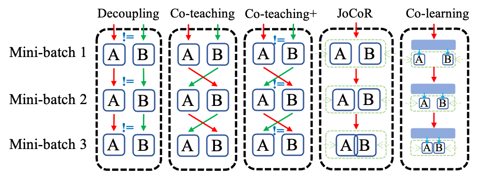

# Co-learning: Learning from noisy labels with self-supervision

This repository contains a unified framework for co-training-based noisy label learning methods. 

The official implementation of the paper **Co-learning: Learning from noisy labels with self-supervision** is also included.

<p align="center">
     <br>
</p>

# Introduction

<details open>
<summary>Supported algorithms</summary>

- [x] [Decoupling (NeurIPS'2017)](algorithms/Decoupling.py)
- [x] [Co-teaching (NeurIPS'2018)](algorithms/Coteaching.py)
- [x] [Co-teaching+ (ICML'2019)](algorithms/Coteachingplus.py)
- [x] [JoCoR (CVPR'2020)](algorithms/JoCoR.py)
- [x] [Co-learning (MM'2021)](algorithms/Colearning.py)
</details>

<details open>
<summary>Supported datasets:</summary>

- [x] CIFAR-10
- [x] CIFAR-100
</details>

<details open>
<summary>Supported synthetic noise types:</summary>

- [x] 'sym'  (Symmetric noisy labels)
- [x] 'asym' (Asymmetric noisy labels)
- [x] 'ins'  (Instance-dependent noisy labels)
</details>

# Dependency

* numpy
* torch, torchvision
* scipy
* addict
* matplotlib

# Citation

If you are interested in our repository and our paper, please cite the following paper:

```
@inproceedings{tan2021co,
  title={Co-learning: Learning from noisy labels with self-supervision},
  author={Tan, Cheng and Xia, Jun and Wu, Lirong and Li, Stan Z},
  booktitle={Proceedings of the 29th ACM International Conference on Multimedia},
  pages={1405--1413},
  year={2021}
}
```
